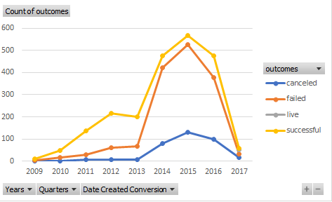
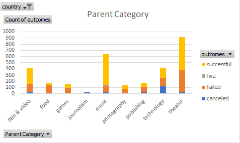
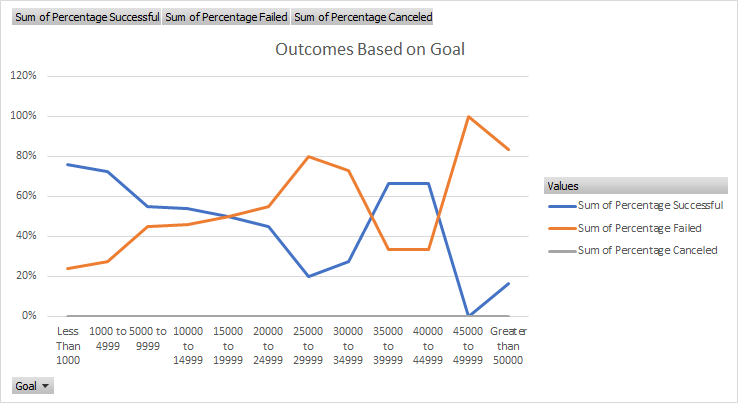

# An Analysis of Kickstarter Campaigns (1.6.1)
### Various categories were analyzed including but not limited to: location, funds needed/received, success rate, etc. to aid in determining the ideal parameters for Louise to begin a kickstarter for her desired play.
---
Review the following charts for detail:

Based on these preliminary findings, it is recommended that if Louise decides to create a play in Great Britain, she should lower her pledge goal to a lower expectation than the initial $4,000.

---

# Kickstarting with Excel (Module 1 Challenge)

## Overview of Project

### Purpose
The purpose of this analysis was to advise Louise on the outcomes of other and previous theater campaigns in relation to their launch date as well as previous play campaigns with relation to their monetary fundraising goals. This analysis will help Louise by giving her a better idea of how her own personal play campaign might fare based on previous trends. Analyzing the launch date can give Louise indications on the optimal time for her to begin her fundraiser. Additionally, analyzing the fundraising goal amount can give Louise a better understanding on a reasonable limit she should expect to set her goal limit to in order to maintain the confidence that her campaign will still succeed. To arrive at these conclusions for Louise, the relevant data was filtered. Pivot charts and visuals were created to display the results.
## Analysis and Challenges

### Analysis of Outcomes Based on Launch Date
This analysis was conducted by first filtering the dataset for relevant data. For Deliverable 1, the pieces of data that were deemed relevant were: (1) the parent category specifically filtered to theater campaigns as well as the ability to filter through years as needed, (2) the launch date of those campaigns by month, and (3) the total count of all possible outcomes within all years filtered by months. 

### Analysis of Outcomes Based on Goals
In this instance, there were four central pieces of data that were deemed relevant: (1) the subcategory of the campaign (plays), (2) the date these campaigns were launched, (3) the monetary fundraising goals of these campaigns, and (4) whether the outcomes of these campaigns resulted in success, failure, or were canceled. Please see the graph below for the corresponding results.

### Challenges and Difficulties Encountered
A potential factor that could be considered a challenge is the fact that although canceled play campaigns within all the various fundraising goal ranges were considered, there was no data for this in any range. This might give Louise or any other potential playwright the assumption that all play campaigns regardless of their fundraising goals are never canceled and will always result in either success or failure. Another factor regarding cancelation to consider is if canceled fundraisers can also be deemed failures?

## Results

Based on the data and visualization regarding theater campaigns based on their launch date, preliminary conclusions can be drawn that May and June were the two most popular months to begin theater campaign fundraising, as they had the highest totals. May and June also have had the highest rate of being successful. Despite this, May and June also appear to be the months with the highest failures as well. October was the only month that had no cancellations regardless of the year.

Regarding play campaign outcomes based on the fundraising goal amount, one preliminary conclusion that can be drawn is that play campaigns are never canceled and will either be successful or fail. 

There are possible limitations	 to this dataset to consider. This dataset can be filtered to theater and plays, but it does not include a category to filter for genre. Genre of the play could be an important factor to consider because people may feel either more willing or less willing to pledge to a fundraiser depending on if the intended campaign fits their likes and preferences. For instance, perhaps campaigns for historical plays may garner more fundraising pledges than campaigns for comedy plays. This could end up impacting Louise’s campaign without her knowing about it.

Therefore, another possible graph or table that can be created is one that includes genre as a factor. However, the dataset would probably have to be manually edited to include this information before these graphs and charts can be created.
- What are two conclusions you can draw about the Outcomes based on Launch Date?

- What can you conclude about the Outcomes based on Goals?

- What are some limitations of this dataset?

- What are some other possible tables and/or graphs that we could create?
